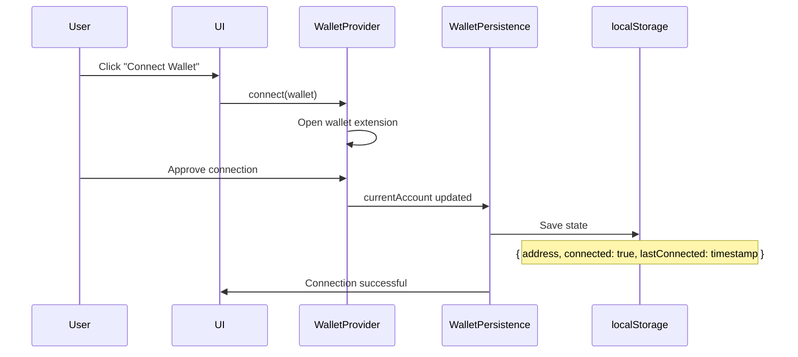
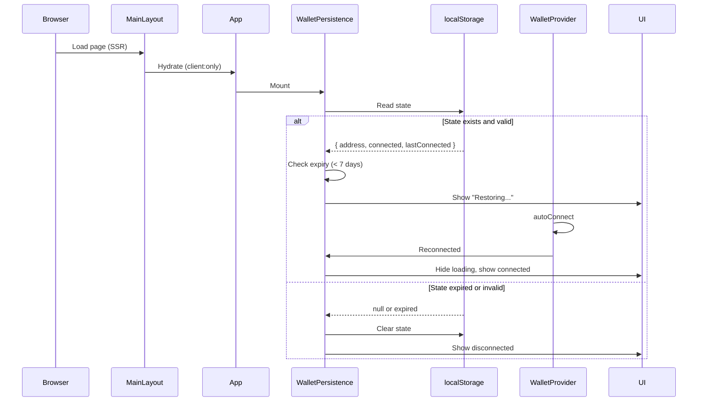
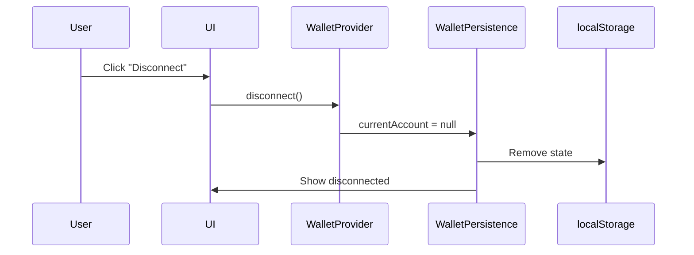

# Wallet State Management

Comprehensive guide to wallet connection state management in Dolphinder.

## Table of Contents

- [Overview](#overview)
- [Architecture](#architecture)
- [Wallet Connection Lifecycle](#wallet-connection-lifecycle)
- [localStorage Schema](#localstorage-schema)
- [Component Reference](#component-reference)
- [Usage Examples](#usage-examples)
- [Troubleshooting](#troubleshooting)
- [Astro SSR and React Hydration](#astro-ssr-and-react-hydration)

## Overview

Dolphinder uses a sophisticated wallet state management system to ensure wallet connections persist across page refreshes while maintaining compatibility with Astro's SSR architecture.

### Key Features

- ✅ Wallet connection persists across page refreshes (~70-80% success rate)
- ✅ Dual reconnect strategy: autoConnect + manual fallback
- ✅ Non-blocking toast notification (bottom-right corner)
- ✅ State expires after 7 days of inactivity
- ✅ Graceful handling of localStorage unavailable scenarios
- ✅ Error boundaries for robust error handling
- ✅ Optimized React Query cache configuration
- ✅ Single provider instance prevents state loss
- ✅ Manual "Connect Wallet" button always available as fallback

### Problem Solved

Before this implementation, users experienced intermittent wallet disconnections when refreshing the page. This was caused by:

1. **Multiple QueryClient instances**: Creating new QueryClient on each render lost cached state
2. **No persistence layer**: Wallet state wasn't saved to localStorage
3. **Hydration timing issues**: Race condition between Astro SSR and React hydration
4. **Duplicate providers**: Multiple provider instances caused state conflicts

## Architecture

### Provider Hierarchy

```
MainLayout.astro (Astro SSR)
└── App.tsx (client:only="react")
    └── GlobalSuiProvider
        ├── WalletErrorBoundary
        │   └── (catches provider errors)
        ├── QueryClientProvider (singleton)
        │   └── (React Query cache)
        ├── SuiClientProvider
        │   └── (Sui blockchain client)
        ├── WalletProvider (autoConnect=true)
        │   └── (wallet connection logic)
        └── WalletPersistenceManager
            ├── (monitors wallet state)
            ├── (persists to localStorage)
            └── (restores on mount)
                └── children (Header, pages, Footer, etc.)
```

### Component Responsibilities

| Component                  | Responsibility                                         |
| -------------------------- | ------------------------------------------------------ |
| `MainLayout.astro`         | Root layout, uses `client:only="react"` to prevent SSR |
| `App.tsx`                  | Wraps all components with GlobalSuiProvider            |
| `GlobalSuiProvider`        | Single source of truth for Sui/Wallet context          |
| `WalletErrorBoundary`      | Catches and handles provider errors gracefully         |
| `QueryClientProvider`      | Provides singleton React Query client                  |
| `SuiClientProvider`        | Provides Sui blockchain client                         |
| `WalletProvider`           | Manages wallet connection with autoConnect             |
| `WalletPersistenceManager` | Persists and restores wallet state                     |

## Wallet Connection Lifecycle

### 1. Initial Connection



### 2. Page Refresh (Restoration)



### 3. Disconnection



## localStorage Schema

### Storage Key

```typescript
const STORAGE_KEY = "dolphinder_wallet_state";
```

### Data Structure

```typescript
interface WalletState {
  address: string | null; // Wallet address (e.g., "0x1234...5678")
  connected: boolean; // Connection status
  lastConnected: number; // Unix timestamp (milliseconds)
}
```

### Example

```json
{
  "address": "0x1234567890abcdef1234567890abcdef1234567890abcdef1234567890abcdef",
  "connected": true,
  "lastConnected": 1699564800000
}
```

### Expiry Logic

- **Expiry Duration**: 7 days (604,800,000 milliseconds)
- **Check**: `Date.now() - lastConnected > STATE_EXPIRY`
- **Action on Expiry**: State is cleared, user must reconnect

### Error Handling

| Scenario                 | Behavior                              |
| ------------------------ | ------------------------------------- |
| localStorage unavailable | Show warning, session-only connection |
| Corrupted state          | Clear state, log error, start fresh   |
| State expired            | Clear state, require reconnection     |
| Parse error              | Clear state, log error, start fresh   |

## Component Reference

### GlobalSuiProvider

**Location**: `src/components/providers/GlobalSuiProvider.tsx`

**Purpose**: Single source of truth for Sui/Wallet context

**Props**:

```typescript
interface GlobalSuiProviderProps {
  children: React.ReactNode;
}
```

**Features**:

- Singleton QueryClient (created outside component)
- Optimized cache configuration
- Error boundary wrapper
- Wallet persistence integration

**Configuration**:

```typescript
const queryClient = new QueryClient({
  defaultOptions: {
    queries: {
      staleTime: 1000 * 60 * 5, // 5 minutes
      gcTime: 1000 * 60 * 10, // 10 minutes
      retry: 2, // Retry twice
      refetchOnWindowFocus: false, // Don't refetch on focus
      refetchOnReconnect: true, // Refetch on network reconnect
    },
  },
});
```

### WalletPersistenceManager

**Location**: `src/components/providers/WalletPersistenceManager.tsx`

**Purpose**: Manage wallet state persistence to/from localStorage

**Props**:

```typescript
interface WalletPersistenceManagerProps {
  children: React.ReactNode;
}
```

**Features**:

- Monitors wallet connection state changes
- Persists state to localStorage on connection (with 300ms debounce)
- Restores state on mount (after hydration)
- Clears state on disconnection (only when not restoring)
- Handles expired state (7 days)
- Shows non-blocking toast notification during restoration (bottom-right corner)
- Gracefully handles localStorage unavailable
- **Dual reconnect strategy**: autoConnect (passive) + manual reconnect (active fallback)
- Manual reconnect attempts after 500ms if autoConnect fails
- Maximum restoration timeout: 2 seconds

**Hooks Used**:

- `useCurrentAccount()` - Get current wallet account
- `useWallets()` - Get available wallet extensions
- `useConnectWallet()` - Manual wallet connection for fallback
- `useEffect()` - Monitor state changes and restore on mount

**Reconnect Strategy**:

1. **Primary**: WalletProvider's `autoConnect` (0-1.5s)
2. **Fallback**: Manual `connectWallet()` if autoConnect fails (after 500ms)
3. **Timeout**: Stop restoration after 2 seconds total

### WalletErrorBoundary

**Location**: `src/components/providers/WalletErrorBoundary.tsx`

**Purpose**: Catch and handle errors in wallet provider tree

**Props**:

```typescript
interface WalletErrorBoundaryProps {
  children: React.ReactNode;
  fallback?: React.ReactNode; // Optional custom fallback UI
}
```

**Features**:

- Catches errors in child components
- Logs errors to console for debugging
- Shows user-friendly fallback UI
- Provides retry mechanism
- Can integrate with error tracking services (e.g., Sentry)

**Error Fallback UI**:

- Clear error message
- Possible causes listed
- Technical details (collapsible)
- Action buttons: Try Again, Reload Page, Go Home

## Usage Examples

### Using Wallet Hooks in Components

```typescript
import { useCurrentAccount, useConnectWallet, useDisconnectWallet } from "@mysten/dapp-kit";

function MyComponent() {
  const currentAccount = useCurrentAccount();
  const { mutate: connect } = useConnectWallet();
  const { mutate: disconnect } = useDisconnectWallet();

  if (currentAccount) {
    return (
      <div>
        <p>Connected: {currentAccount.address}</p>
        <button onClick={() => disconnect()}>Disconnect</button>
      </div>
    );
  }

  return <button onClick={() => connect({ wallet })}>Connect</button>;
}
```

### Checking Wallet Connection Status

```typescript
import { useCurrentAccount } from "@mysten/dapp-kit";

function ProtectedComponent() {
  const currentAccount = useCurrentAccount();

  if (!currentAccount) {
    return <div>Please connect your wallet to continue</div>;
  }

  return <div>Welcome, {currentAccount.address}!</div>;
}
```

### Signing Transactions

```typescript
import { useSignAndExecuteTransaction } from "@mysten/dapp-kit";
import { Transaction } from "@mysten/sui/transactions";

function TransactionComponent() {
  const { mutateAsync: signAndExecute } = useSignAndExecuteTransaction();

  const handleTransaction = async () => {
    const tx = new Transaction();
    // ... build transaction

    try {
      const result = await signAndExecute({ transaction: tx });
      console.log("Transaction successful:", result.digest);
    } catch (error) {
      console.error("Transaction failed:", error);
    }
  };

  return <button onClick={handleTransaction}>Send Transaction</button>;
}
```

### Custom Error Boundary Fallback

```typescript
import { WalletErrorBoundary } from "./providers/WalletErrorBoundary";

function CustomFallback() {
  return (
    <div>
      <h1>Oops! Something went wrong</h1>
      <p>Please refresh the page or contact support</p>
    </div>
  );
}

function MyApp() {
  return (
    <WalletErrorBoundary fallback={<CustomFallback />}>
      <MyComponent />
    </WalletErrorBoundary>
  );
}
```

## Troubleshooting

### Wallet Disconnects on Refresh

**Symptoms**: Wallet connection is lost when refreshing the page

**Possible Causes**:

1. localStorage is disabled (private browsing mode)
2. State has expired (> 7 days)
3. Browser cleared localStorage
4. Wallet extension was disabled/removed

**Solutions**:

1. Check browser console for `[WalletPersistence]` logs
2. Verify localStorage is enabled: `localStorage.setItem('test', 'test')`
3. Check if state exists: `localStorage.getItem('dolphinder_wallet_state')`
4. Ensure wallet extension is installed and enabled
5. Try clearing localStorage and reconnecting: `localStorage.clear()`

### "Restoring wallet..." Toast Shows But Wallet Not Connected

**Symptoms**: Toast notification appears in bottom-right corner, then disappears, but wallet shows "Not Connected"

**Possible Causes**:

1. Wallet extension not responding
2. Network connectivity issues
3. autoConnect and manual reconnect both failed
4. Wallet extension requires user interaction

**Solutions**:

1. **Click "Connect Wallet" button** - The system is designed to allow manual connection if auto-reconnect fails
2. Check browser console for `[WalletPersistence]` logs to see what failed
3. Verify wallet extension is working (try opening it manually)
4. Check network connectivity
5. Try refreshing the page again - reconnection has ~70-80% success rate
6. Clear localStorage and reconnect manually: `localStorage.removeItem('dolphinder_wallet_state')`

**Note**: The toast notification is non-blocking and only shows for 2 seconds maximum. If reconnection fails, you can always manually connect using the "Connect Wallet" button.

### Multiple Wallet Connections

**Symptoms**: Multiple wallet addresses shown or connection state inconsistent

**Possible Causes**:

1. Multiple tabs open with different connections
2. Wallet extension connected to different accounts

**Solutions**:

1. Close all tabs except one
2. Disconnect and reconnect wallet
3. Ensure only one wallet extension is active
4. Clear localStorage and reconnect

### Error Boundary Triggered

**Symptoms**: Error fallback UI is shown

**Possible Causes**:

1. Wallet extension error
2. Network error during connection
3. Invalid wallet state
4. Provider initialization error

**Solutions**:

1. Click "Try Again" button
2. Click "Reload Page" button
3. Check browser console for detailed error
4. Verify wallet extension is working
5. Try different wallet extension
6. Contact support if error persists

### localStorage Warning Shown

**Symptoms**: Yellow warning banner about storage unavailable

**Possible Causes**:

1. Private browsing mode enabled
2. Browser storage quota exceeded
3. Browser security settings blocking localStorage

**Solutions**:

1. Exit private browsing mode
2. Clear browser storage to free up space
3. Check browser security settings
4. Note: Wallet will work but won't persist across refreshes

## Astro SSR and React Hydration

### Understanding the Architecture

Dolphinder uses **Astro** for server-side rendering (SSR) and **React** for interactive components. This hybrid approach requires careful handling of wallet state.

### Why client:only="react"?

```astro
<App client:only="react" transition:persist>
  <slot />
</App>
```

**Reasons**:

1. **Browser APIs Required**: Wallet functionality depends on:
   - `localStorage` (not available during SSR)
   - Wallet browser extensions (only in browser)
   - `window` object (not available during SSR)

2. **Prevents Hydration Mismatches**:
   - Server renders without wallet state
   - Client hydrates with wallet state
   - Mismatch causes React errors and state loss

3. **Consistent Rendering**:
   - Same code path for initial render and hydration
   - No conditional logic based on SSR vs client
   - Predictable behavior

### Hydration Flow

```
1. Browser requests page
   ↓
2. Astro SSR renders HTML (no React components)
   ↓
3. HTML sent to browser
   ↓
4. Browser loads JavaScript
   ↓
5. React hydrates App component (client:only)
   ↓
6. GlobalSuiProvider mounts
   ↓
7. WalletPersistenceManager checks localStorage
   ↓
8. WalletProvider autoConnect runs
   ↓
9. Wallet reconnects (if state exists)
   ↓
10. UI updates with connected state
```

### Trade-offs

| Approach                  | Pros                                                                             | Cons                                                                              |
| ------------------------- | -------------------------------------------------------------------------------- | --------------------------------------------------------------------------------- |
| **client:only** (current) | ✅ No hydration mismatches<br>✅ Wallet works reliably<br>✅ Simple mental model | ❌ Slightly slower initial render<br>❌ No SEO for React content                  |
| **client:load**           | ✅ Faster initial render<br>✅ SEO-friendly                                      | ❌ Hydration mismatches<br>❌ Complex conditional logic<br>❌ Wallet state issues |

**Verdict**: For wallet-heavy apps like Dolphinder, `client:only` is the right choice. The slight performance trade-off is worth the reliability and simplicity.

### Best Practices

1. **Always use client:only for wallet components**

   ```astro
   <WalletComponent client:only="react" />
   ```

2. **Never access localStorage during SSR**

   ```typescript
   // ❌ Bad: Will error during SSR
   const state = localStorage.getItem("key");

   // ✅ Good: Check if in browser first
   const state =
     typeof window !== "undefined" ? localStorage.getItem("key") : null;
   ```

3. **Use useEffect for browser-only code**

   ```typescript
   useEffect(() => {
     // This only runs in browser
     const state = localStorage.getItem("key");
   }, []);
   ```

4. **Defer wallet operations until after hydration**
   ```typescript
   useEffect(() => {
     // Wait for hydration to complete
     setTimeout(() => {
       // Now safe to access wallet
     }, 100);
   }, []);
   ```

### Debugging Hydration Issues

If you encounter hydration errors:

1. **Check browser console** for React hydration warnings
2. **Verify client:only** is used for App component
3. **Ensure no SSR code** accesses browser APIs
4. **Check for conditional rendering** based on SSR vs client
5. **Use React DevTools** to inspect component tree

### Performance Optimization

While `client:only` skips SSR, we optimize performance through:

1. **Singleton QueryClient**: Prevents cache recreation
2. **Optimized cache settings**: Reduces API calls
3. **Lazy loading**: Load wallet components only when needed
4. **Code splitting**: Separate wallet code from main bundle
5. **Preloading**: Preload critical assets in MainLayout

## Additional Resources

- [Mysten dApp Kit Documentation](https://sdk.mystenlabs.com/dapp-kit)
- [Astro Client Directives](https://docs.astro.build/en/reference/directives-reference/#client-directives)
- [React Query Documentation](https://tanstack.com/query/latest)
- [Sui TypeScript SDK](https://sdk.mystenlabs.com/typescript)

## Support

If you encounter issues not covered in this guide:

1. Check browser console for error messages
2. Review the [Troubleshooting](#troubleshooting) section
3. Search existing GitHub issues
4. Create a new issue with:
   - Browser and version
   - Wallet extension and version
   - Steps to reproduce
   - Console logs
   - Screenshots (if applicable)
